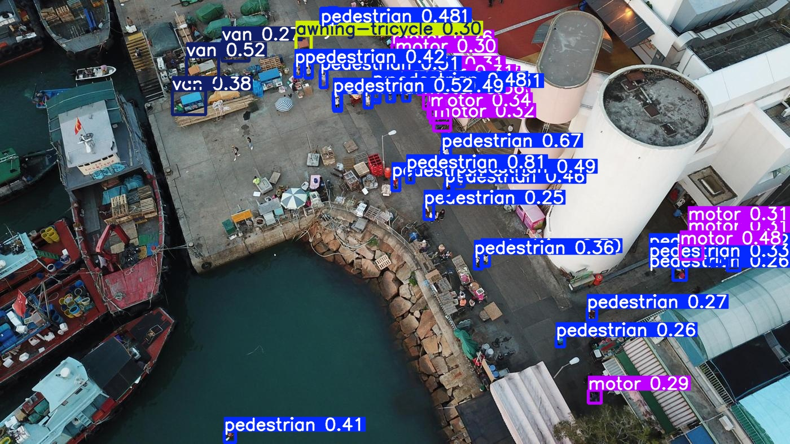
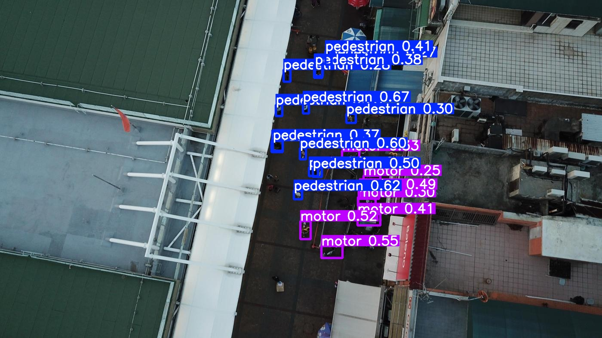
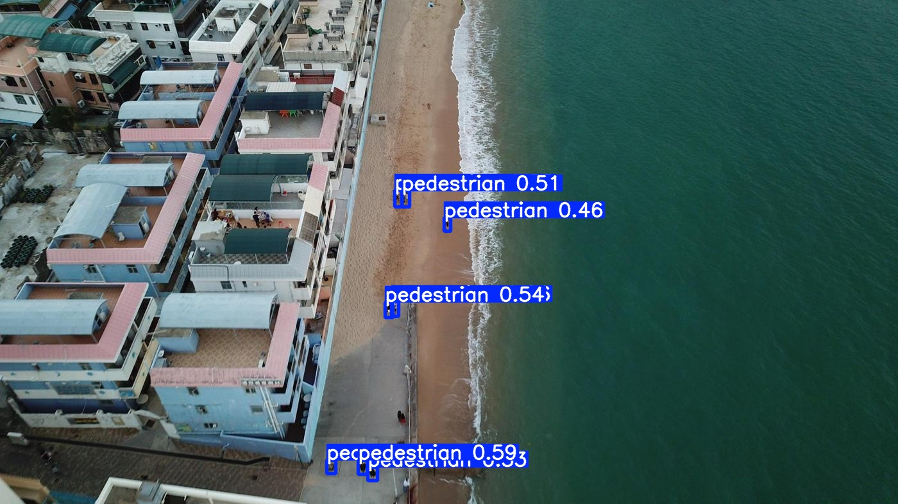

# VisDrone Object Detection — YOLOv26n

## 🚀 Highlights

- Trained on 38K+ annotated objects
- Achieved mAP@50: **0.33**
- Strong performance on large objects, weaker on small/rare classes

Drone-view object detection on the [VisDrone 2019](https://www.kaggle.com/datasets/banuprasadb/visdrone-dataset/data) dataset using YOLOv26n, trained from scratch on Kaggle.

---

## Training Setup

| Parameter | Value |
|-----------|-------|
| Model | YOLOv26n (2.37M params, 5.2 GFLOPs) |
| Dataset | VisDrone 2019 (10 classes) |
| Image size | 640 × 640 |
| Epochs | 50 |
| Batch size | default |
| Hardware | Kaggle — Tesla T4 × 2 |
| Training time | ~2.1 hours |
| Augmentation | Mosaic, Albumentations (blur, grayscale, CLAHE) |

---

## Results

| Metric | Value |
|--------|-------|
| mAP@50 | 0.334 |
| mAP@50-95 | 0.189 |
| Precision | 0.44 |
| Recall | 0.336 |

**Per-class mAP@50**

| Class | mAP@50 |
|-------|--------|
| car | 0.752 |
| bus | 0.437 |
| motor | 0.384 |
| pedestrian | 0.379 |
| van | 0.364 |
| truck | 0.310 |
| people | 0.294 |
| tricycle | 0.215 |
| awning-tricycle | 0.126 |
| bicycle | 0.082 |

---

## Key Findings

- **Severe class imbalance (~45:1)** — `car` has 144k samples vs `awning-tricycle` at 3.2k
- Performance strongly correlates with training sample count
- Model was still improving at epoch 50 — more epochs will help
- Small/rare objects remain the core challenge on drone imagery

Overall performance is moderate, with strong detection for frequent classes and weaker generalization on rare and small objects.

---

## Sample Predictions

<p float="left">
  
  
  
</p>

---

## Setup

```bash
pip install -r requirements.txt
```

---

## 📦 Model Weights

Download: [best.pt](link_here)

## Inference

```python
from ultralytics import YOLO

model = YOLO("model/best.pt")
results = model.predict("image.jpg", conf=0.25, imgsz=640, save=True)
```

---

## Project Structure

```
model/          # best.pt weights
config/         # dataset YAML
results/        # training logs, prediction images
notebook/       # training + analysis notebook
```

---

## What's Next

- Train longer (100 epochs) — model hadn't converged
- Upgrade to YOLOv26s/m for more capacity
- Use `imgsz=1280` for better small object detection
- Apply SAHI slice inference for rare/tiny classes
